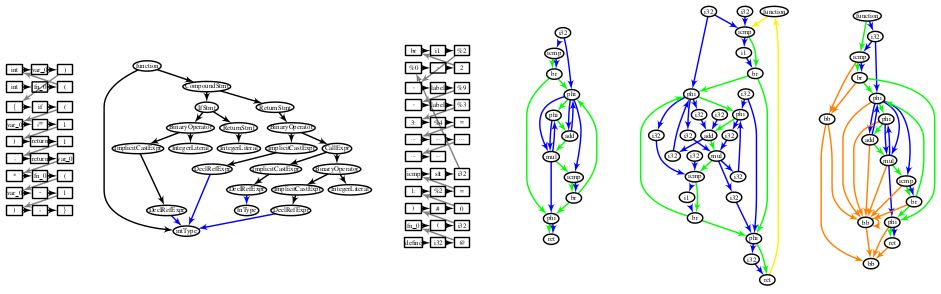
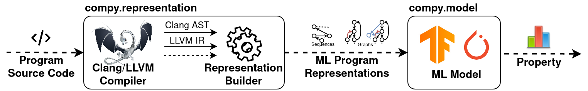

<p align="center">
  
</p>

# ComPy-Learn
[](https://travis-ci.com/alexanderb14/compy-learn)
[](https://codecov.io/gh/alexanderb14/compy-learn)
[](https://opensource.org/licenses/Apache-2.0)

ComPy-Learn is a framework for defining and exploring program representations for machine learning on source code (ML4CODE) tasks.
While the special focus is on compiler optimization tasks, ComPy-Learn can also be used in other domains like software engineering, or systems security.

## Project goals
* **Exploration of best-performing code representation and model:** Depending on the task, different representations and models have shown to be differently suitable. Finding the best-performing one is not obvious and currently requires empirical evaluation. ComPy-Learn provides a common framework for that - evaluating different representations on a given task to find the best-performing one.
* **Design and discovery of new representations:** Custom, task-specific representations of code can improve a models performance. However, extracting representations of program code is a tedious endeavor and requires low-level development with compiler tools. We aim to take away this burden by enabling to define program representations with a simple, high-level programming interface. This allows easier design and faster iterations.
* **Common tools, evaluation pipeline and datasets:** Several promising representations and models to learn embeddings from those representations have been proposed in recent time. However, they use unique tools and pipelines for evaluations, making further comparisons to those methods time-consuming and difficult. ComPy-Learn provides a common framework for representations, models, and datasets and allows for evaluation of their combinations. Implementing a novel representation and model in this framework enables researches to do an effort-less and complete evaluation on the one hand, on the other hand contributes another widely applicable method to the community.

## Design
ComPy-Learn's main components are shown in the pipeline below:
<p align="center">
  
</p>

* `compy.representation` allows the user to define custom representations (such as the ones from published work) of source code based on available semantic compiler-internal information, currently from the Clang/LLVM framework. Both, linear and graph representations of code are supported.
* `compy.model` contains ML-models (in fact, it provides connectors to well-established model libraries) that embed the representations into vectors and finally output a prediction.
* `compy.dataset` contains datasets of source code for evaluation, along with helper functions that allow integration of new datasets.


## Supported representations
Currently, the following representations and models from published work are implemented in this framework:
* [Cummins, Chris, et al. "End-to-end deep learning of optimization heuristics."](https://ieeexplore.ieee.org/document/8091247) 2017 26th International Conference on Parallel Architectures and Compilation Techniques (PACT). IEEE, 2017.
* [Barchi, Francesco, et al. "Code Mapping in Heterogeneous Platforms Using Deep Learning and LLVM-IR."](https://dl.acm.org/doi/10.1145/3316781.3317789) 2019 56th ACM/IEEE Design Automation Conference (DAC). IEEE, 2019.
* [Brauckmann, Alexander, et al. "Compiler-based graph representations for deep learning models of code."](https://dl.acm.org/doi/abs/10.1145/3377555.3377894) Proceedings of the 29th International Conference on Compiler Construction. ACM, 2020.
* [Cummins, Chris, et al. "ProGraML: Graph-based Deep Learning for Program Optimization and Analysis."](https://arxiv.org/abs/2003.10536) arXiv preprint arXiv:2003.10536 (2020).

## Installation

We supply an installation script that automates the build, test, and installation process. The script currently supports the platforms listed below. Because the process builds ComPy-Learn from its sources, other platforms can be used with a bit of manual installation effort. 

Platform | Build status
--- | ---
Ubuntu 16.04 | [](https://travis-ci.com/alexanderb14/compy-learn)
Ubuntu 18.04 | [](https://travis-ci.com/alexanderb14/compy-learn)
Ubuntu 20.04 | [](https://travis-ci.com/alexanderb14/compy-learn)

To get started on one of the supported platforms, we suggest to first create a virtual environment, then run:
```
./install_deps.sh ${CUDA}
```
whereas `${CUDA}` needs to be `cpu`, `cu92`, `cu100` or `cu102`, depending on your machine's capabilities.

After successful installation, ComPy-Learn should be compiled and tested. To do so, please run:
```
python setup.py test
```

Finally, install ComPy-Learn in order to use it in your project:
```
python setup.py install
```

An example exploration is located in `examples/devmap_exploration.py`.


## Publications
* Brauckmann, Alexander, et al. "ComPy-Learn: A Toolbox for Exploring Machine Learning Representations for Compilers." (to appear). 2020 Forum for Specification and Design Languages (FDL). IEEE, 2020.
